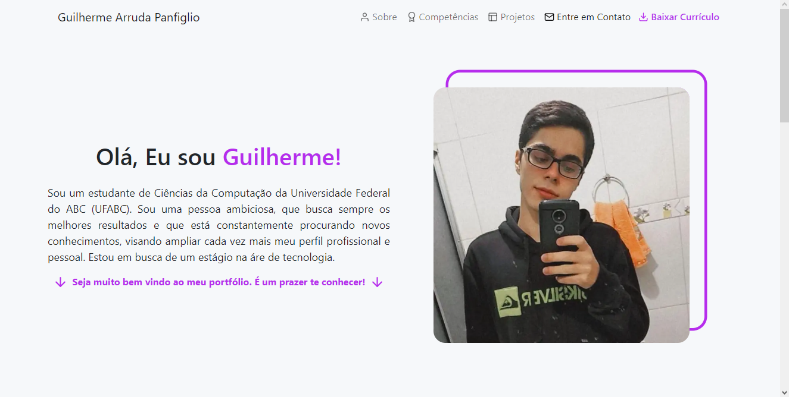

# Personal Portfolio

Personal portfolio made to share my professional profile.

## Web Version

 
  

## Mobile Version

 
  

## Technologies

* Next.js
* Styled Components
* React Bootstrap
* ESLint
* Prettier

## 🤖 Demo

You can view the project demo at [https://personal-portfolio-guilherme-arruda.vercel.app](https://personal-portfolio-guilherme-arruda.vercel.app).

## 🚀 Getting Started

Clone or download it as ZIP file. Open your terminal, go to the project folder and run `npm install` or `yarn` to install all dependencies. To run the project, run `npm dev` or `yarn dev` and it'll open on localhost.

## 📄 License

This project is under MIT license - see the file [LICENSE.md](https://github.com/Guilherme-Arruda/personal-portfolio/blob/master/LICENSE) for details.

---

##### Coded with love by Guilherme Arruda ♥️